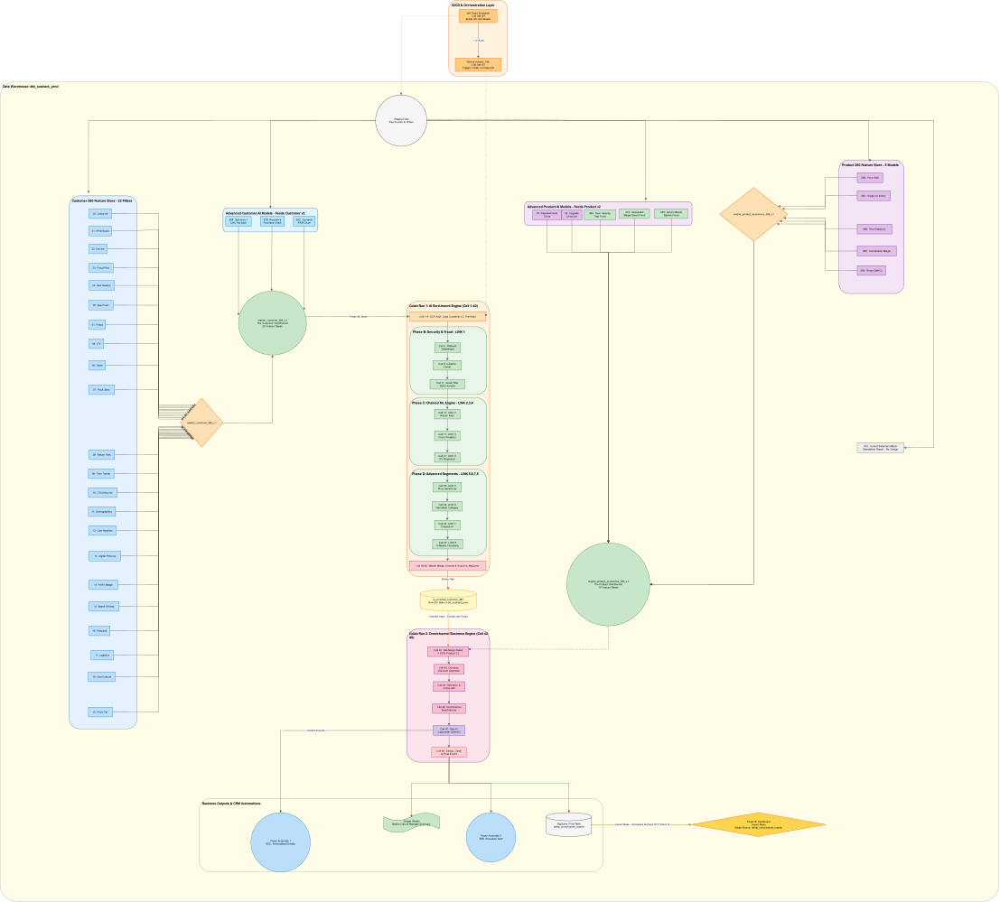
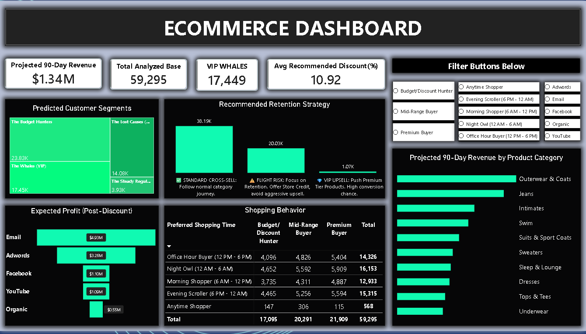

# 🛒 E-commerce ETL + AI Omnichannel Intelligence Platform

**An automated, production-grade data pipeline that transforms raw e-commerce data into AI-driven business decisions — fully hands-off, running on a schedule every single night.**

[](https://www.getdbt.com/)
[](https://cloud.google.com/bigquery)
[](https://github.com/features/actions)
[](https://colab.research.google.com/)
[](https://powerbi.microsoft.com/)
[](https://ai.google.dev/)

---

## 📖 Overview

This project takes a raw e-commerce dataset and turns it into a **fully automated, self-refreshing intelligence system**. Every night, without any manual trigger:

1. Fresh data is pulled and modeled through **45+ dbt SQL models**
2. **8 chained machine learning models** score every customer (fraud, churn, LTV, price sensitivity, and more)
3. A **5-phase business logic engine** turns those scores into margin, discount, and cross-sell decisions
4. **Generative AI (Gemini)** writes ready-to-send marketing copy for each customer segment
5. Results land in **BigQuery**, get summarized to **Google Sheets**, and trigger a **manager email alert** — all before the business day starts
6. A **Power BI dashboard** sits on top, refreshed and ready every morning

No human touches the pipeline between the data landing and the dashboard being ready.

---

## 🏗️ Architecture


> 🔍 **[Open the diagram in draw.io](https://app.diagrams.net/#Uhttps://raw.githubusercontent.com/Skysushant7366/ecommerce-etl-pipeline/main/docs/architecture.drawio)** — pan and zoom through every layer (dbt models, the 8-link AI chain, the 5-phase engine, etc.)

<details>
<summary><strong>📊 Click to view the full-resolution diagram (SVG)</strong></summary>



</details>

---

## 🔄 End-to-End Pipeline Flow

| Stage | What happens | Schedule |
|---|---|---|
| **1. Source** | `thelook_ecommerce` — BigQuery public sample dataset (7 raw tables) | Continuously updated by Google |
| **2. dbt Cloud** | 45+ SQL models: staging → 25 feature pillars → 12 derived models → 5 master tables | Scheduled build |
| **3. dbt Scheduled Job** | `Daily_Production_Pipeline` rebuilds all 45 models with fresh source data | **1:30 AM IST** daily |
| **4. Production Dataset** | All rebuilt tables land in `dbt_sushant_prod` (dev dataset `dbt_sushant` is kept fully separate and untouched by automation) | — |
| **5. GitHub Actions** | `ai_engine_automation.yml` triggers the Colab AI notebook via `papermill`, using encrypted repo secrets | **2:30 AM IST** daily |
| **6. Colab AI Engine** | `ai_omnichannel_engine.ipynb` runs headless — see breakdown below | ~5-8 min runtime |
| **7. Outputs** | Final BigQuery table, Google Sheets executive summary, Power Automate → manager email | Same run |
| **8. Power BI** | Dashboard connected live to the final production table | Refreshed daily |

---

## 🗄️ Layer 1 — dbt SQL Modeling (45+ Models)

Built and version-controlled in **dbt Cloud**, connected to BigQuery, and pushed to GitHub for full auditability.

```
Staging Sources (5)
 ├─ stg_users, stg_products, stg_orders, stg_order_items, stg_inventory_items
 │
 ▼
Feature Pillar Models (25)
 ├─ customer_segmentation, churn_prediction, fraud_detection, ltv_prediction,
 │  taste_matchmaker, price_sensitivity, return_risk, time_trends,
 │  lifetime_value, demographics, cart_abandonment, digital_persona,
 │  profit_margin, brand_affinity, temporal_context, logistics_experience,
 │  demographics_geo, price_tier_affinity, customer_lifecycle, rfm_score,
 │  device_ecosystem, fraud_risk, geo_seasonality, app_frustration, market_basket
 │
 ▼
Model Layer (12)
 ├─ price_elasticity, contribution_margin, retail_gmroi, recursive_purchase_chain,
 │  geospatial_margin_bleed, surge_pricing_inventory, dynamic_rfm_churn,
 │  solvency_cac_payback, replenishment_cycle, upgrade_lifecycle, toxic_velocity_trap,
 │  apriori_market_basket, cohort_retention_matrix
 │
 ▼
Master Tables (5) — final dbt output
 ├─ customer_360, product_economics_360, customer_360_v2, product_economics_360_v2
```

**Why no `CREATE OR REPLACE`?** Early versions used raw hardcoded `CREATE OR REPLACE TABLE` SQL directly in BigQuery, which broke automation. All 45+ queries were rewritten as proper dbt models (no hardcoding) and rebuilt into a clean **production dataset (`dbt_sushant_prod`)**, kept fully separate from the original dev dataset.

📄 Full lineage graph: [`docs/sql_pipeline_tree.svg`](docs/sql_pipeline_tree.svg)

---

## 🧠 Layer 2 — Colab AI Omnichannel Engine

`ai_omnichannel_engine.ipynb` — runs fully headless in GitHub Actions via `papermill`, no manual execution needed.

### Stage A — Auth & Load
- Smart dual-mode GCP authentication (service-account key in CI, OAuth in interactive Colab)
- Loads `Customer 360 v2` base dataframe (161K+ rows, 80 columns) from `dbt_sushant_prod`

### Stage B — 8 Chained AI Models (sequential, each feeds the next)

| # | Model | What it predicts |
|---|---|---|
| 1 | **Gatekeeper** | Fraud detection (XGBoost) + zero-day anomaly detector |
| 2 | **Return Risk** | Probability a customer returns their order |
| 3 | **Churn Risk** | Chained from Return Risk output |
| 4 | **LTV Forecast** | Regression, chained from Churn Risk |
| 5 | **Price Sensitivity** | Reality-pivot discount response model |
| 6 | **Next-Best Category** | Recommendation AI |
| 7 | **Channel AI** | Pro-grade cascading channel-affinity model |
| 8 | **Segmentation** | K-Means master customer clustering |

### Stage C — Master Merge & Export
All 8 model outputs merge into **Enriched Customer 360**, exported to BigQuery gold layer (`dbt_sushant_prod`).

### Stage D — Matchmaker + 5-Phase Business Logic Engine

| Phase | Function |
|---|---|
| **Matchmaker** | Merges customer profile with product-level profit economics |
| **Phase 1 & 2** | Net-margin bleed predictor |
| **Phase 3** | Dynamic discount optimizer (XGBoost) |
| **Phase 4** | Solvency & cross-sell engine (XGBoost) |
| **Phase 5** | Omnichannel delivery engine |

### Stage E — Gen-AI Copywriter & Final Export
- **Gemini** generates ready-to-send marketing copy per customer segment
- Deduplicates, exports final table `lethal_omnichannel_master_360` to BigQuery
- Pushes executive summary to **Google Sheets**
- Triggers **Power Automate webhook** → manager email alert

---

## ⚙️ Automation & CI/CD

```yaml
# .github/workflows/ai_engine_automation.yml
on:
  schedule:
    - cron: '0 21 * * *'   # 2:30 AM IST
  workflow_dispatch:
```

- **Secrets management** — nothing hardcoded, all credentials stored as encrypted GitHub repository secrets:
  `GCP_CREDENTIALS`, `GEMINI_API_KEY`, `POWER_AUTOMATE_WEBHOOK_URL`, `MANAGER_WEBHOOK_URL`
- **Runtime**: Python 3.12, `papermill` executes the notebook headlessly and saves execution logs
- **1-hour buffer** built in between the dbt refresh (1:30 AM) and the AI engine run (2:30 AM), so the AI engine always reads fully refreshed production data

---

## 📊 Power BI Dashboard

Connected live to `lethal_omnichannel_master_360` in `dbt_sushant_prod`.



**Key metrics surfaced:**
- Projected 90-Day Revenue
- VIP Whale identification & count
- AI-predicted customer segments (Budget Hunters, Whales, Lost Causes, Steady Regulars)
- Recommended retention strategy per segment (Cross-sell / Flight-risk / VIP upsell)
- Expected post-discount profit by acquisition channel
- Shopping behavior cross-tab (time-of-day × spend tier)
- Revenue forecast by product category

---

## 🧰 Tech Stack

| Layer | Tools |
|---|---|
| **Data Warehouse** | Google BigQuery |
| **Transformation** | dbt Cloud (Fusion engine) |
| **Orchestration / CI-CD** | GitHub Actions |
| **AI / ML** | Python, XGBoost, scikit-learn, K-Means, Google Gemini (GenAI) |
| **Execution Runtime** | Google Colab + papermill |
| **Automation / Alerts** | Power Automate, Gmail |
| **Reporting Layer** | Google Sheets, Power BI |
| **Version Control** | Git + GitHub |

---

## 📁 Repository Structure

```
ecommerce-etl-pipeline/
├── models/
│   ├── staging/              # 5 staging models
│   ├── marts/                # feature pillars, model layer, master tables
├── ai_omnichannel_engine.ipynb   # full Colab AI engine
├── .github/workflows/
│   └── ai_engine_automation.yml  # CI/CD schedule
├── docs/
│   ├── architecture.drawio       # editable draw.io source file
│   ├── architecture.png          # architecture diagram (PNG)
│   ├── architecture.svg          # architecture diagram (high-res SVG)
│   ├── sql_pipeline_tree.svg     # full 45-model dependency graph
│   └── dashboard_preview.png
├── dbt_project.yml
└── README.md
```

---

## 🚀 Running This Project

1. **dbt Cloud**: connect to BigQuery, point at the `thelook_ecommerce` public dataset, run `dbt build` — models land in `dbt_sushant_prod`
2. **GitHub Actions**: add the 4 required secrets under *Settings → Secrets and variables → Actions*
3. Trigger manually via **Run workflow**, or let it run on schedule
4. Open **Power BI**, connect to `dbt_sushant_prod.lethal_omnichannel_master_360`, refresh

---

## 👤 Author

**Sushant Kumar Yadav**
B.Com (Hons), University of Delhi — Aspiring Data / Business Analyst
📫 Open to Data Analyst / Business Analyst / Analytics Engineer roles

---

⭐ If this project is useful, consider starring the repo!
